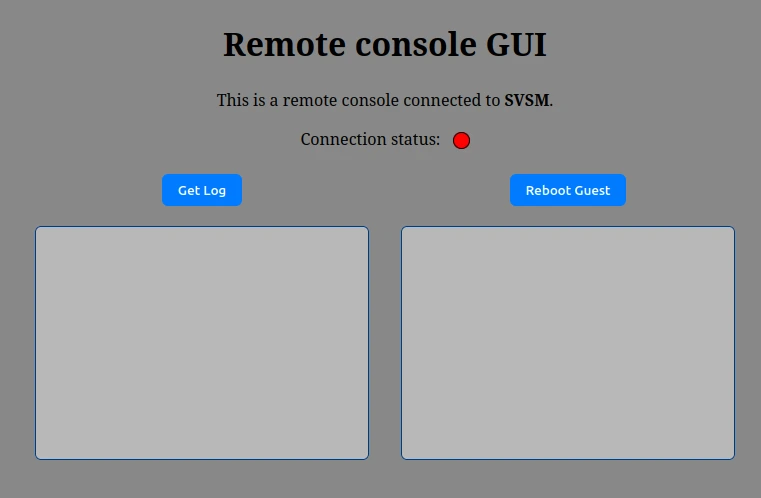

# Remote Console

Remote Console (RC) is a small web server that exposes services provided by SVSM to web clients. RC keeps a persistent, mutually authenticated TLS channel to svsm and queries it to serve client requests.

This repository contains:

- A Rust-based async web server (RC)
- Mutual TLS between RC and svsm for the persistent channel
- Basic web GUI in `static/` to access available services

## Services currently offered

- View SVSM log buffer
- Reboot guest

### Behaviour

- RC establishes and maintains a persistent TLS connection to svsm. That connection uses mutual authentication (client and server certificates).
- Clients interact with RC through HTTP APIs. When a request arrives, RC queries SVSM to handle it.
- A minimal GUI is provided in `static/` that shows connection state and offers buttons for the two services.

## How to Test

### Component Structure
Clone both [https://github.com/n-ramacciotti/svsm.git](https://github.com/n-ramacciotti/svsm.git) and this repository into the same parent folder, so they are at the same directory level. This is required because RC expects the TLS certificates to be located at `../svsm/certificates/` inside the SVSM repository.

#### Folder structure example
```
parent_folder/
  |- svsm/
  |- remote_console/
```

#### Certificates generation
The mutual TLS channel requires a client certificate/key for RC and a server certificate/key for svsm both signed by a CA:
- If TLS authentication fails: verify the client cert/key and CA trust chain used by RC and svsm.

To generate the certificates, run the script in the SVSM repository:
```bash
git checkout remote_console_interaction
svsm/scripts/gen_certs.sh
```
This script will generate certificates for the CA, RC, and SVSM.

### Start Remote Console:

```bash
# From the repository root
cargo run
```

It is possible now to open the gui in the browser at the followig address: `http://localhost:3000`

### Start socat 

Start socat to bridge a VSOCK listener (used by SVSM) to a local TCP port that RC will connect to. Example:

```bash
socat -d -d VSOCK-LISTEN:12345,reuseaddr,fork TCP:localhost:4433
```

### Start SVSM
Compile and launch the guest (QEMU). Example:

```bash
make FEATURES=tls,server
QEMU=/path/to/qemu-system-x86_64 scripts/launch_guest.sh --nocc --vsock 3
```
#### Note
- A more detailed SVSM documentation with the required version of QEMU and other tools is available in `Documentation/docs/installation/INSTALL.md` inside the svsm repository.
- SVSM must be started after both socat and RC.

### **Important Testing Notes**
- The size of the log buffer is for the moment fixed at 4096 (page size byte). As it is implemented (ring buffer), new writes will overwrite old values
- RC accepts a single connection to SVSM (for the moment). **Everytime the connection is dropped it is necessary to stop and start both RC and SVSM again**.

## Interface
The GUI shows an indicator for whether RC is connected to svsm and two buttons for the exposed services (view logs, reboot guest).



## Demo
This demo illustrates the interaction between RC and SVSM, showing the four main components:

- **socat** (bottom left)  
- **SVSM**  (top left)  
- **RC**    (top right)  
- **GUI**   (bottom right)

In this demo:
- certificates are generated using `scritps/gen_certs.sh`
- SVSM is compiled using `make FEATURES=tls,server` 
- RC is launched with `cargo run`. 
- Socat is started with the command `socat -d -d VSOCK-LISTEN:12345,reuseaddr,fork TCP:localhost:4433`
- the GUI can be accessed through `http://localhost:3000/`.
- SVSM itself is launched via QEMU using the script `QEMU=path/to/qemu-system-x86_64 scripts/launch_guest.sh --nocc --vsock 3`.

During the demo, we can observe the Socat logs as SVSM and RC exchange messages. At the same time, the GUI displays the output of the API log buffer several times, allowing us to monitor the interactions visually.

We also attempted to use the reboot API; however, this action fails because the demo is running in a native environment, and the reboot command requires sev-snp support. As a result, the client will see the following message `Reboot initiation failed`.

https://github.com/user-attachments/assets/e30798f9-1b2e-42cf-9634-9af9698074d2